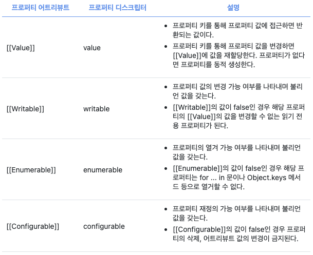
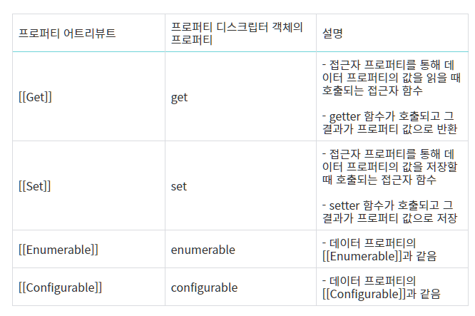
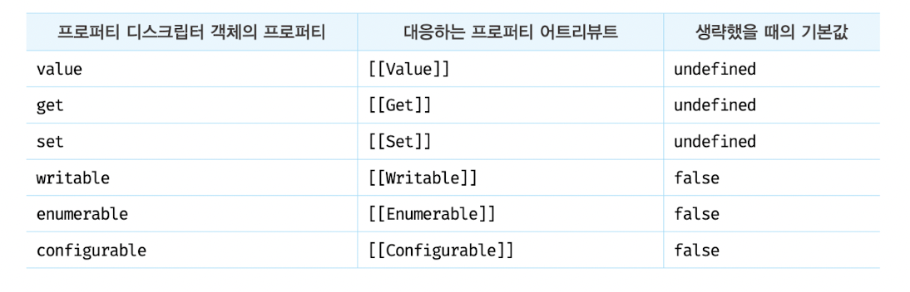

# 💡 프로퍼티 어트리뷰트

### ✔ 내부 슬롯과 내부 메서드
- 내부 슬롯과 메서드는 JS 엔진의 구현 알고리즘을 설명하기 위해 ECMAScript 사양에서 사용하는 의사 프로퍼티와 의사 메서드다
- ECMAScript 사양에 등장하는 이중 대괄호([[...]])로 감싼 이름들이 내부 슬롯과 내부 메서드이다
---

### ✔ 프로퍼티 어트리뷰트와 프로퍼티 디스크립터 객체
- JS 엔진은 프로퍼티를 생성할 때 프로퍼티의 상태를 나타내는 프로퍼티 어트리뷰트를 기본값으로 자동 정의한다
- 프로퍼티의 상태란 프로퍼티의 값, 값의 갱신 가능 여부, 열거 가능 여부, 재정의 가능 여부를 말한다
- 프로퍼티 어트리뷰트에 직접 접근할 수는 없지만, Onject.getOwnPropertyDescriptor 메서드를 사용하여 간접적으로 확인할 수 있다
```
const person = {
 name: 'Lee' 
};

person.age = 100;

console.log(Object.getOwnPropertyDescriptors(person));
/*
{
	name: {value: "Lee", writable: true, enumerable: true, configurable: true}
    age: {value: 100, writable: true, enumerable: true, configurable: true}
}
*/
```
---

### ✔ 데이터 프로퍼티와 접근자 프로퍼티

#### 1. 데이터 프로퍼티 (Data Property)
- 키와 값으로 구성된 일반적인 프로퍼티이다
- 

#### 2. 접근자 프로퍼티 (Accessor Property)
- 자체적으로는 값을 갖지 않고 다른 데이터 프로퍼티의 값을 읽거나 저장할 때 호출되는 접근자 함수로 구성된 프로퍼티다
- 

```
const person = {
 // 데이터 프로퍼티
 firstName: "bw",
 lastName: "Lee",
  
 // getter 함수 (접근자 프로퍼티)
 get fullName() {
   return `${this.firstName} ${this.lastName}`; 
 },
 // setter 함수  
 set fullName(name) {
   // 배열 디스트럭처럼 할당
   [this.firstName, this.lastName] = name.split(' ');
 }
};

// 데이터 프로퍼티를 통한 프로퍼티 값의 참조
console.log(person.firstName + ' ' + person.lastName); // bw Lee

// 접근자 프로퍼티를 통한 프로퍼티 값의 참조
// 접근자 프로퍼티 fullName에 값을 저장하면 setter 함수가 호출된다
person.fullName = "Heegun Lee";
console.log(person); //{firstName: "Heegun", lastName: "Lee"}

// 접근자 프로퍼티를 통한 프로퍼티 값의 참조
// 접근자 프로퍼티 fullName에 접근하면 getter 함수가 호출된다.
console.log(person.fullName); // Heegun Lee

// firstName은 데이터 프로퍼티다
// 데이터 프로퍼티는 [[Value]], [[Writable]], [[Enumerable]], [[Configurable]] 프로퍼티 어트리뷰트를 갖는다
let descriptor = Object.getOwnPropertyDescriptor(person, 'firstName');
console.log(descriptor);
// {value: "Lee", writable : true, enumerable : true, configurable: true}

// fullName은 접근자 프로퍼티다
// 접근자 프로퍼티는 [[Get]], [[Set]], [[Enumerable]], [[Configurable]] 프로퍼티 어트리뷰트를 갖는다
descriptor = Object.getOwnPropertyDescriptor(person, 'fullName')
console.log(descriptor);
// {get: f, set: f, enumerable: true, configurable: true}
```
---

### ✔ 프로퍼티 정의
- `Object.defineProperty` 메서드를 사용하면 프로퍼티의 어트리뷰트를 정의할 수 있다 
- 디스크럽터 객채의 프로퍼티를 누락시키면 undefined, false가 기본값이다
- `Enumerable`의 값이 false인 경우, 해당 프로퍼티는 열거할 수 없다
- `Writeable`의 값이 false인 경우, 해당 프로퍼티의 `[[Value]]`의 값을 변경할 수 없다
- `Configurable`의 값이 false인 경우, 해당 프로퍼티를 삭제 또는 재정의 할 수 없다
- 
```
const person = {};

// 데이터 프로퍼티 정의
Object.defineProperty(person, 'firstName', {
  value: 'Ungmo',
  writable: true,
  enumerable: true,
  configurable: true
});

// 디스크럽터 객채의 프로퍼티를 누락시키면 undefined, false가 기본값이다
Object.defineProperty(person, 'lastName', {
  value: 'Lee'
})
```
---

### ✔ 객체 변경 방지
- 객체는 변경 가능한 값이므로 재할당 없이 직접 변경할 수 있다

#### 1. 객체 확장 금지
- Object.preventExtensions 메서드는 객체의 확장을 금지한다
- **확장이 금지된 객체는 프로퍼티 추가가 금지된다**

```
const person = { name : 'Lee'};

// person 객체는 확장이 금지된 객체가 아니다
console.log(Object.isExtensible(person)); // true

// person 객체의 확장을 금지하여 프로퍼티 추가를 금지한다
Object.preventExtensions(person);

// person 객체는 확장이 금지된 객체다
console.log(Object.isExtensible(person)); // false

// 프로퍼티 추가가 금지된다
person.age = 20; // 무시. strict mode에서는 에러
console.log(person); // {name : "Lee"}

// 프로퍼티 추가는 금지되지만 삭제는 가능하다
delete person.name;
console.log(person); // {}


// 프로퍼티 정의에 의한 프로퍼티 추가도 금지된다
Object.defineProperty(person, 'age', {value:20});
// TypeError: Cannot define property age, object is not extensible
```

#### 2. 객체 밀봉
- Object.seal 메서드는 객체를 밀봉한다
- **밀봉된 객체는 읽기와 쓰기만 가능하다**
```
const person = {name: 'Lee'};

// person 객체는 밀봉된 객체가 아니다
console.log(Object.isSealed(person)); // false

// person 객체를 밀봉하여 프로퍼티 추가, 삭제, 재정의를 금지한다
Object.seal(person);

// person 객체는 밀봉된 객체다
console.log(Object.isSealed(person)); // true

// 밀봉된 객체는 configurable이 false이다
console.log(Object.getOwnPropertyDescriptors(person));
/*
{
  name: {value: "Lee", writable: true, enumerable: true, configurable: false},
}
*/

// 프로퍼티 추가가 금지된다
person.age = 20; // 무시. strict mode에서는 에러
console.log(person); // {name: "Lee"}

// 프로퍼티 삭제가 금지된다
delete.person.name; // 무시. strict mode에서는 에러
console.log(person); // {name: "Lee"}

// 프로퍼티 값 갱신은 가능하다.
person.name = "Kim";
console.log(person); // {name : "Kim"}

// 프로퍼티 어트리뷰트 재정의가 금지된다.
Object.defineProperty(person, 'name', {configurable : true});
// TypeError: Cannot redefine property: name
```

#### 3. 객체 동결
- Object.freeze 메서드는 객체를 동결한다
- **동결된 객체는 읽기만 가능하다**
```
const person = {name: 'Lee'};

// person 객체는 동결된 객체가 아니다
console.log(Object.isFrozen(person)); // false

// person 객체를 동결하여 프로퍼티 추가, 삭제, 재정의, 쓰기를 금지한다
Object.freeze(person);

// person 객체는 동결된 객체다
console.log(Object.isFrozen(person)); // true

// 동결된 객체는 writable과 configurable이 false이다
console.log(Object.getOwnPropertyDescriptors(person));
/*
{
  name: {value: "Lee", writable: false, enumerable: true, configurable: false},
}
*/

// 프로퍼티 추가가 금지된다
person.age = 20; // 무시. strict mode에서는 에러
console.log(person); // {name: "Lee"}

// 프로퍼티 삭제가 금지된다
delete.person.name; // 무시. strict mode에서는 에러
console.log(person); // {name: "Lee"}

// 프로퍼티 값 갱신은 가능하다.
person.name = "Kim";
console.log(person); // {name : "Kim"}

// 프로퍼티 어트리뷰트 재정의가 금지된다.
Object.defineProperty(person, 'name', {configurable : true});
// TypeError: Cannot redefine property: name
```

#### 4. 불변 객체
- 지금까지 살펴본 변경 방지 메서드들은 얕은 변경 방지로 직속 프로퍼티만 변경이 방지되고, 중첩 객체까지는 영향을 주지는 못한다
- Object.freeze 메서드로 객체를 동결하여도 중첩 객체까지 동결할 수 없다
- 객체의 중첩 객체까지 불변 객체로 구현하려면 객채를 값으로 갖는 모든 프로퍼티에 대해 재귀적으로 Object.freeze 메서드를 호출해야 한다
---