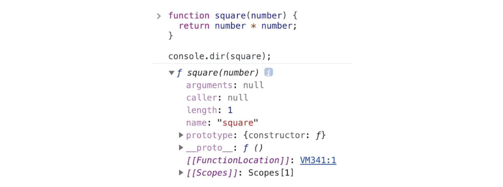

# 💡 함수와 일급 객체

### ✔ 일급 객체
- 다음과 같은 조건을 만족하는 객체를 **일급 객체**라고 한다
  1. 무명의 리터럴로 생성할 수 있다. 즉, 런타임에 생성이 가능하다
  2. 변수나 자료구조에 저장할 수 있다
  3. 함수의 매개변수에 전달할 수 있다
  4. 함수의 반환값으로 사용할 수 있다
- javaScript의 함수는 다음 예제와 같이 위의 조건을 모두 만족하므로 일급 객체다
```
// 1. 함수는 무명의 리터럴로 생성할 수 있다
// 2. 함수는 변수에 저장할 수 있다
// 런타임에 함수 리터럴이 평가되어 함수 객체가 생성되고 변수가 할당된다
const increase = function (num) {
  return ++num;
};

const decrease = function (num) {
  return --num;
};

// 2. 함수는 객체에 저장할 수 있다
const auxs = { increase, decrease };

// 3. 함수의 매개변수에 전달할 수 있다
// 4. 함수의 반환값으로 사용할 수 있다
function makeCounter(aux) {
  let num = 0;

  return function () {
    num = aux(num);
    return num;
  };
}

// 3. 함수는 매개변수에게 함수를 전달할 수 있다.
const increaser = makeCounter(auxs.increase);
console.log(increaser()); // 1
console.log(increaser()); // 2

// 3. 함수는 매개변수에게 함수를 전달할 수 있다.
const decreaser = makeCounter(auxs.decrease);
console.log(decreaser()); // -1
console.log(decreaser()); // -2
```
---

### ✔ 함수 객체의 프로퍼티
- 함수도 프로퍼티를 가질 수 있다
  1. arguments
  2. caller
  3. length
  4. name
  5. prototype

```
function square(number) {
  return number * number;
}
console.dir(square);
```
- 

#### 1. arguments 프로퍼티
- arguments 객체는 함수 호출 시 전달된 인수들의 정보를 담고 있는 순회 가능한 유사 배열 객체이다
- 함수 내부에서 지역 변수처럼 사용되며, 외부에서는 참조가 불가능하다
- javaScript의 함수는 매개변수와 인수의 개수가 일치하는지 확인하지 않고, 에러도 발생하지 않는다

```
function multiply(x, y) {
  console.log(arguments);
  return x * y;
}

console.log(multiply());         //NaN
console.log(multiply(1));        //NaN
console.log(multiply(1, 2));     //2
console.log(multiply(1, 2, 3));  //2
```

- 선언된 매개변수의 개수보다 인수를 적게 전달했을 경우, 전달되지 않은 매개변수는 `undefined`로 초기화된 상태를 유지한다
- 더 많은 인수를 전달한 경우에는 무시된다
- **다만,** 버려지는것은 아니고, 암묵적으로 arguments 객체의 프로퍼티로 보관된다 

#### 2. caller 프로퍼티
- ECMAScript 사양에 포함되지 않은 비표준 프로퍼티로, 함수 객체의 caller 프로퍼티는 함수 자신을 호출한 함수를 가리킨다

#### 3. length 프로퍼티
- 함수 객체의 length 프로퍼티는 함수를 정의할 때 선언한 매개변수의 개수를 가리킨다
```
function foo() {}
console.log(foo.length); // 0

function bar(x) {}
console.log(bar.length); // 1
```

#### 4. name 프로퍼티
- 함수의 이름을 나타낸다
- ES6에 정식 표준이 되었고, ES5에서는 다르게 동작하므로 주의해아한다

#### 5. __proto__ 접근자 프로퍼티
- 모든 객체는 [[Protytype]]라는 내부 슬롯을 갖는다
- [[Protytype]] 내부 슬롯이 가리키는 프로토타입 객체에 접근하기 위해 사용하는 접근자 프로퍼티이다
- [[Protytype]] 내부 슬롯에 직접 접근할 수 없으며, \__proto\__ 접근자 프로퍼티를 통해 간접적으로 접근 할 수 있다
```
const obj = { a: 1 };

// 객체 리터럴 방식으로 생성한 객체의 프로토타입 객체는 Object.prototype이다
console.log(obj.__proto__ === Object.prototype); // true

// 객체 리터럴 방식으로 생성한 객체는 프로토타입 객체인 Object.prototype의 프로퍼티를 상속받는다
// hasOwnProperty 메서드는 Object.prototype의 메서드다
console.log(obj.hasOwnProperty('a'));   // true
console.log(obj.hasOwnProperty('__proto__'); // false
```

#### 6. prototype 프로퍼티
- 생성자 함수로 호출할 수 있는 함수 객체, 즉 constructor만이 소유하는 프로퍼티이다
- 일반 객체와 생성자 함수로 호출할 수 없는 non-constructor에는 prototype 프로퍼티가 없다
```
// 함수 객체는 prototype 프로퍼티를 소유한다
(fuction () {}).hasOwnProperty('prototype'); // true

// 일반 객체는 prototype 프로퍼티를 소유하지 않는다
({}).hasOwnProperty('prototype'); // false
```
---