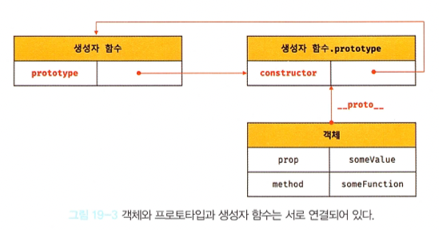
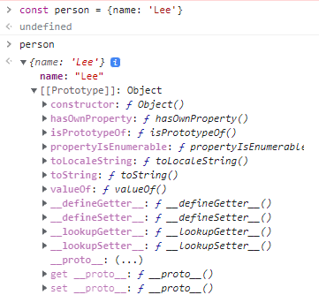
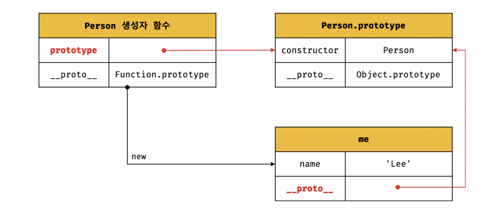
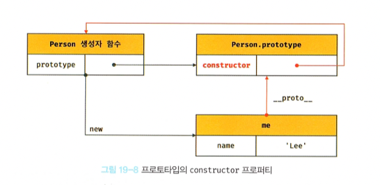

# 💡 프로토 타입
- JavaScript는 객체 기반의 프로그래밍 언어이며, JavaScript를 이루고 있는 거의 **모든 것**이 객체다

### ✔ 객체지향 프로그래밍
- 객체(Object)의 집합으로 프로그램을 표현하려는 프로그래밍 패러다임이다
- 특징이나 성징을 나타내는 속성(Property)을 가지고 있고, 이를 통해 실체를 인식하거나 구별할 수 있다
- "이름"과 "주소"라는 속성을 갖는 person이라는 객체를 JavaScript로 표현하면 다음과 같다
```
// 이름과 주소 속성을 갖는 객체
const person = {
  name: 'Lee',
  address: 'Suwon'
};

console.log(person); // {name: "Lee", address: "Suwon"}
```
---

### ✔ 상속과 프로토타입
- 상속은 어떤 객채의 프로퍼티 또는 메서드를 다른 객체가 상속받아 그대로 사용할 수 있는 것을 말한다
- JavaScript는 프로토타입을 기반으로 상속을 구현하여 불필요한 중복을 제거한다

```
// 생성자 함수
function Circle(radius) {
  this.radius = radius;
  this.getArea = function () {
    // Math.PI는 원주율을 나타내는 상수다
    return Math.PI * this.radius ** 2;
  };
}

// 반지름이 1인 인스턴스 생성
const circle1 = new Circle(1);
// 반지름이 2인 인스턴스 생성
const circle2 = new Circle(2);

// Circle 생성자 함수는 인스턴스를 생성할 때마다 동일한 동작을 하는
// getArea 메서드를 중복 생성하고 모든 인스턴스가 중복 소유한다
// getArea 메서드는 하나만 생성하여 모든 인스턴스가 공유해서 사용하는 것이 바람직하다
console.log(circle1.getArea === circle2.getArea); // false

console.log(circle1.getArea()); // 3.141592653589793
console.log(circle2.getArea()); // 12.566370614359172
```
- 위 예제의 생성자 함수에는 문제가 있다
- Circle 생성자 함수는 인스턴스를 생성할 때마다 getArea 메서드를 중복 생성하고 모든 인스턴스가 중복 소유한다
- 상속을 통해 불필요한 중복을 제거할때, JavaScript는 프로토타입(Prototype)을 기반으로 상속을 구현한다

```
// 생성자 함수
function Circle(radius) {
  this.radius = radius;
}

// Circle 생성자 함수가 생성한 모든 인스턴스가 getArea 메서드를
// 공유해서 사용할 수 있도록 프로토타입에 추가한다.
// 프로토타입은 Circle 생성자 함수의 prototype 프로퍼티에 바인딩되어 있다.
Circle.prototype.getArea = function () {
  return Math.PI * this.radius ** 2;
};

// 인스턴스 생성
const circle1 = new Circle(1);
const circle2 = new Circle(2);

// Circle 생성자 함수가 생성한 모든 인스턴스는 부모 객체의 역할을 하는
// 프로토타입 Circle.prototype으로부터 getArea 메서드를 상속받는다.
// 즉, Circle 생성자 함수가 생성하는 모든 인스턴스는 하나의 getArea 메서드를 공유한다.
console.log(circle1.getArea === circle2.getArea); // true

console.log(circle1.getArea()); // 3.141592653589793
console.log(circle2.getArea()); // 12.566370614359172
```
- Circle 생성자 함수가 생성한 모든 인스턴스는 상위 객체 역할을 하는 Circle.prototype의 모든 프로퍼티와 메소드를 상속받는다
- 자신의 상태를 나타내는 radius 프로토타입만 개별적으로 소유하고 내용이 동일한 메소드는 상속을 통해 공유하여 사용하는 것이다
---

### ✔ 프로토타입 객체
- 모든 객체는 [[Prototype]] 이라는 내부 슬롯을 가지며, 내부 슬롯의 값은 프로토타입의 참조다
- [[Prototype]]에 저장되는 프로토타입은 객체 생성 방식에 따라 결정된다


#### 1. __proto__ 접근자 프로퍼티
- 모든 객체는 \__proto__ 접근자 프로퍼티를 통해 자신의 프로토타입, 즉[[Prototype]] 내부 슬롯에 간접적으로 접근할 수 있다


  1. \__proto__는 접근자 프로퍼티다
    - 접근자 프로퍼티는 자체적인 값`[[Value]]`을 갖지 않고, 접근자 함수`[[Get]]`, `[[Set]]` 프로퍼티 어트리뷰드로 구성된 프로퍼티이다
  2. \__proto__ 접근자 프로퍼티는 상속을 통해 사용된다
    - \__proto__ 접근자 프로퍼티는 객체가 직접 소유하는 프로퍼티가 아니라 Object.prototype의 프로퍼티이다
  3. \__proto__ 접근자 프로퍼티를 통해 프로토타입에 접근하는 이유
    - [[Prototype]] 내부 슬롯의 값에 접근할때 접근자 프로퍼티를 사용하는 이유는 상호 참조에 의해 프로토 타입 체인이 생성되는 것을 방지하기 위해서다
    
  4. \__proto__ 접근자 프로퍼티를 코드 내에서 직접 사용하는 것은 권장하지 않는다

#### 2. 함수 객체의 prototype 프로퍼티
- 함수 객체만이 소유하는 prototype 프로퍼티는 생성자 함수가 생성할 인스턴스의 프로토타입을 가리킨다
```
// 함수 객체는 prototype 프로퍼티를 소유한다
(function () {}).hasOwnProperty('prototype'); // true

// 일반 객체는 prototype 프로퍼티를 소유하지 않는다
({}).hasOwnProperty('prototype'); // false
```

- 생성자 함수로서 호출할 수 없는 함수,즉 non-constructor인 화살표 함수와 ES6 축약 표현으로 정의한 메서드는 prototype 프로퍼티를 소유하지 않으며 프로토타입도 생성하지 않는다
```
// 화살표 함수는 non-constructor다
const Person = name => {
  this.name = name;
};

// non-constructor는 prototype 프로퍼티를 소유하지 않는다
console.log(Person.hasOwnProperty('prototype')); // false

// non-constructor는 프로토타입을 생성하지 않는다
console.log(Person.prototype); // undefined

// ES6의 메서드 축약 표현으로 정의한 메서드는 non-constructor다
const obj = {
  foo(){}
};

// non-constructor는 prototype 프로퍼티를 소유하지 않는다
console.log(obj.foo.hasOwnProperty('prototype')); // false

// non-constructor는 프로토타입을 생성하지 않는다
console.log(obj.foo.prototype); // undefined
```
- 모든 객체가 가지고 있는(Object.prototype으로부터 상속받은) \__proto__ 접근자 프로퍼티와 함수 객체만이 가지고 있는 prototype 프로퍼티는 결국 동일한 프로토타입을 가리킨다. 하지만 이들 프로퍼티를 사용하는 주체가 다르다.


#### 3. 프로토타입의 constructor 프로퍼티와 생성자 함수
- constructor 프로퍼티는 prototype 프로퍼티로 자신을 참조하고 있는 모든 생성자 함수(인스턴스를 생성한 생성자 함수)를 가리키고, 이 연결은 함수 객체가 생성될 때 이뤄진다
```
// 생성자 함수
function Person(name) {
  this.name = name;
}

const me = new Person('Lee');

// me 객체의 생성자 함수는 Person이다.
console.log(me.constructor === Person); // true
```


- me 객체에는 constructor 프로퍼티가 없지만, me 객체의 프로토타입인 Person.prototype에는 constructor 프로퍼티가 있다
- 따라서 me 객체는 프로토타입인 Person.prototype의 constructor 프로퍼티를 상속받아 사용할 수 있다

### ✔ 리터럴 표기법에 의해 생성된 객체의 생성자 함수와 프로토타입
