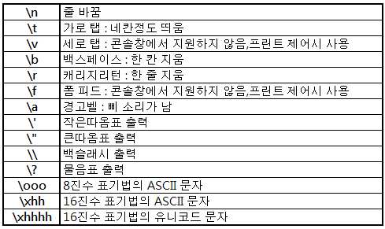

# 데이터 타입
- 테이터 타입은 값의 종류를 말한다
- JavaScript는 7개의 데이터 타입을 제공한다
  - 원시 타입
    1. 숫자 타입
    2. 문자열 타입
    3. Boolean 타입
    4. undefined 타입
    5. null 타입
    6. 심벌 타입
  - 객체 타입

### 숫자 타입
- 다른 언어와는 다르게 JavaScript는 하나의 숫자 타입만 존재한다
- 숫자 타입은 모두 실수로 처리된다
- 추가적으로 세가지 특별한 값도 표현할 수 있다
  1. `Infinity` : 양의 무한대
  2. `-Infinity` : 음의 무한대
  3. `NaN` : 산술 연산 불가(Not a Number)
```
// 모두 숫자 타입이다
var integer = 10;   // 정수
var double = 10.12;   // 실수

var bin = 0b1011;   // 2진수
var oct = 0o307;    // 8진수
var hex = 0x1AB;    // 16진수   
```


### 문자열 타입
- 문자열 타입은 텍스트 데이터를 나타내는 데 사용한다
- 문자열은 작은따옴표(''), 큰따옴표(""), 백틱(``)으로 텍스트를 감싼다

#### 1. 멀티라인 문자열
- 템플릿 리터럴은 일반 문자열과 비슷해 보이지만 따옴표 대신 백틱을 사용해 표현한다
- 일반 문자열 내에서는 줄바꿈이 허용되지 않는다
- 따라서 일반 문자열 내에서 줄바꿈 등의 공백을 표현하려면 백슬래시로 시작하는 이스케이프 시퀀스를 사용해야 한다
- 백틱을 사용하면 이스케이프 시퀀스를 사용하지 않고도 줄바꿈이 허용되며, 모든 공백도 허용된다



#### 2. 표현식 삽입
- 문자열은 문자열 연산자 + 를 사용하여 연결할 수 있다
```
var first = 'bw';
var last = 'Lee';

console.log('My name is ' + first + ' ' + last) .. My name is bw Lee
```

- 표현식을 삽입하려면 ${}으로 표현식을 감싸면 되고, 이때 표현식의 결과가 문자열이 아니더라도 문자열로 강제 변환된다
```
var first = 'bw';
var last = 'Lee';

console.log(`My name is ${first} $(last)`) .. My name is bw Lee
```

### Boolean 타입
- `Boolean` 타입은 참, 거짓을 나타내는 `true`와 `false` 뿐이다
```
var boo = true;
console.log(boo) // true

boo = false;
console.log(boo) // false
```

### undefined 타입
- `undefined` 타입의 값은 `undefined`가 유일하다
- 변수 선언에 의해 확보된 메모리 공간을 처음 할당이 될때까지 빈상태로 두지 않고 JavaScript 엔진이 `undefined`로 초기화한다

### null 타입
- `null` 타입의 값은 `null`이 유일하다
- `null`은 변수에 값이 없다는 것을 의도적으로 명시한다

### Symbol 타입
- 변경 불가능한 원시 타입의 값이고, 다른 값과 중복되지 않는 유일무이한 값이다

