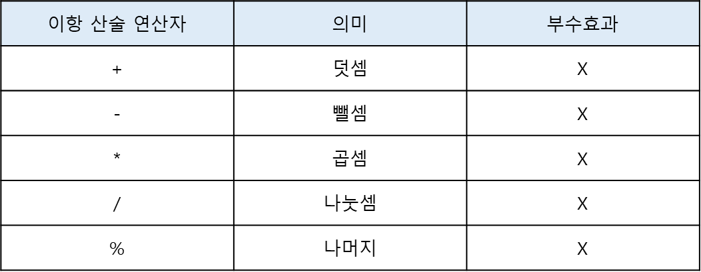
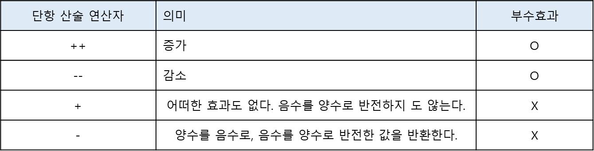

# 💡 연산자

### ✔ 산술 연산자
- 산술 연산자는 피연산자를 대상으로 수학적 계산을 수행해 새로운 숫자값을 만든다
- 산술 연산자는 피연산자의 개수에 따라 이항 산술 연산자와 단항 산술 연산자로 구분할 수 있다

#### 1. 이항 산술 연산자
- 이항 산술 연산자는 2개의 피연산자를 산술 연산하여 숫자 값을 만든다
- 

#### 2. 단항 산술 연산자
- 단항 산술 연산자는 1개의 피연산자를 산술 연산하여 숫자 값을 만든다
- 증가/감소 연산자는 위치에 의미가 있다
- 

#### 3. 문자열 연결 연산자
- '+' 연산자는 피연산자 중 하나 이상이 문자열인 경우 문자열 연결 연산자로 동작한다
```
/// 문자열 연결 연산자
'1' + 2; // '12'
1 + '2'; // '12'

// 산술 연산자
1 + 2; // 3

// true는 1로, false는 0으로 변환된다
// null도 0으로 변환된다
1 + true; // 2

// undefined는 숫자로 변한되지 않는다
+undefined; // NaN
1 + undefined; // NaN
```